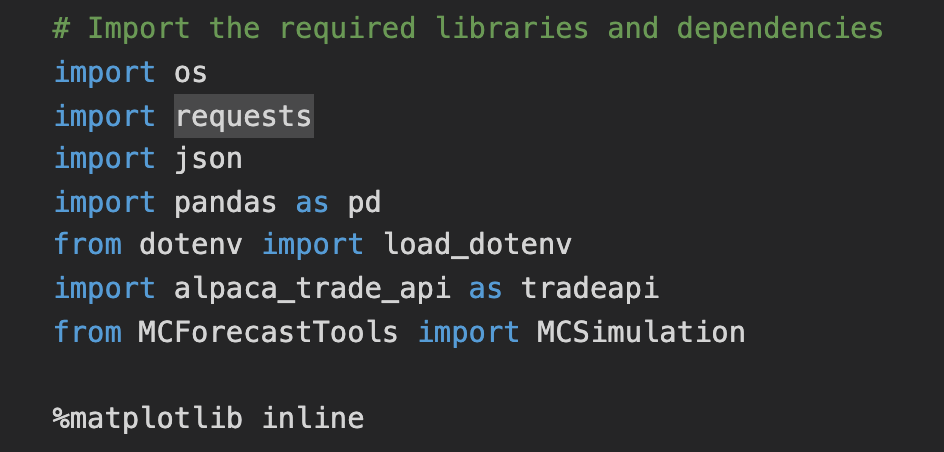
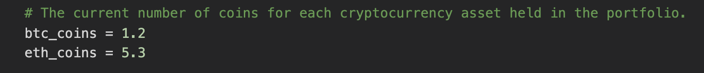
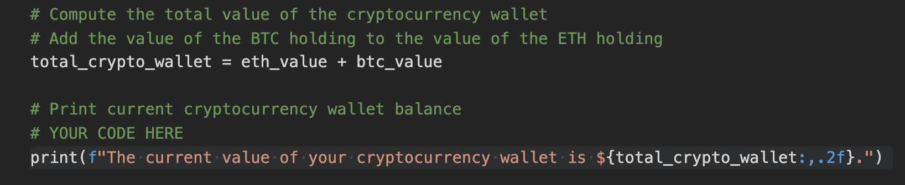
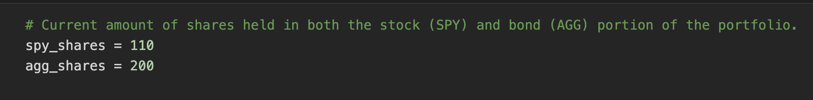
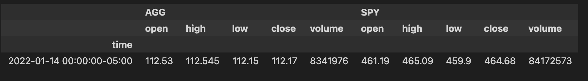
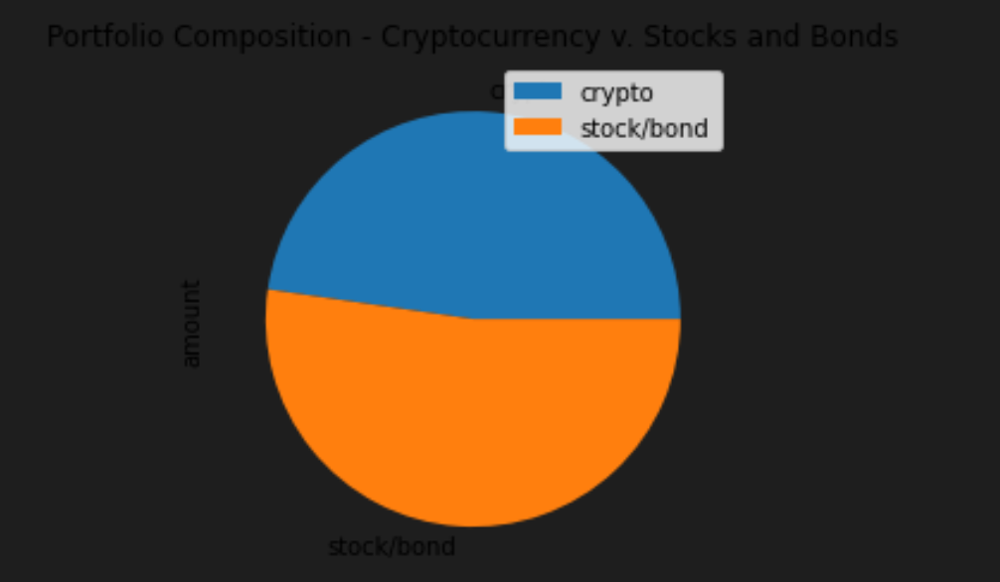
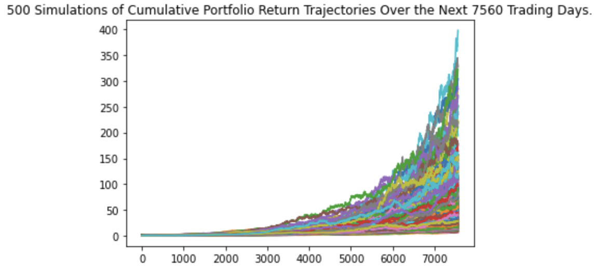
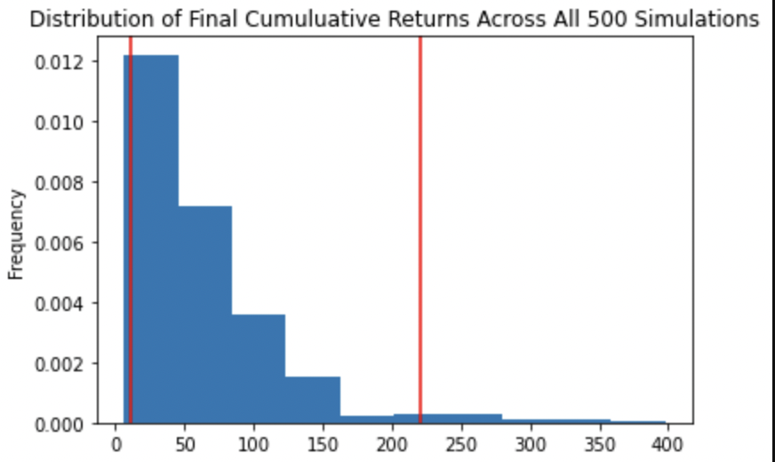
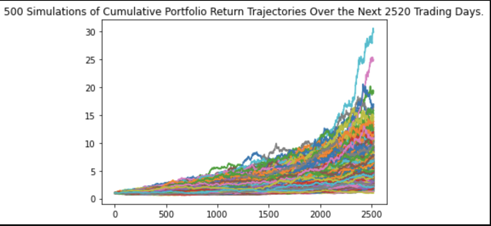
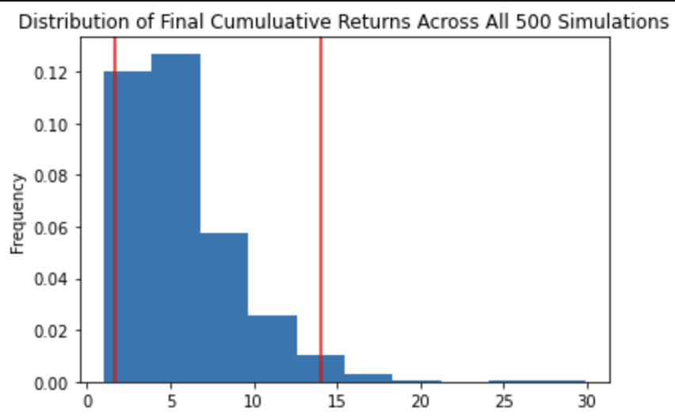

# financial_planning

This helpful application has two primary goals.  First, it takes the value of a member's current portfolio of stocks, bonds, and cryptocurrency and evaluates whether the member has enough funds to constitute a reasonable emergency fund given the member's monthly expenses.  Second, the application determines, using a Monte Carlo simulation, the expected value of the member's portfolio in 10 and 30 years with a varying mix of stocks and bonds.

---

## Technologies

This application runs in a Jupyter Notebook.  

It imports:
- os
- requests
- json
- pandas
- dotenv
- alpaca_trade_api
- MCForecastTools 
- matplotlib

---

## Installation Guide

To properly run this application, you must have MCForecastTools.  Additionally, you will need a .env file containing credentials for Alpaca.  If you do not have credentials, visit *[Alpaca Markets](https://alpaca.markets)*. Otherwise, this software does not require installation.  Simply navigate to the appropriate directory in your terminal and launch a Jupyter Notebook.  Then open the file called financial_planning_tools.ipynb.

---

## Usage

The application begins by accepting a variable for the total number of cryptocurrencies in the member's portfolio.

After pulling the current price of Bitcoin and Ether, the application calculates the total value of the member's cryptocurrency holdings.

Next, the applications accepts the amount of stock the member holds.  Here, the stocks held are a stock etf (SPY) and a bond etf (AGG).

The application then pulls the current (or last) closing price for the stocks.

It then calculates the total current value of the member's portfolio.

The overall weight of the portfolio components is presented in pie chart form.

That number is then used, along with the member's monthly budget to evaluate whether the member has an adequate emergency fund.

From there, the application runs a Monte Carlo simulation and presents the results in two forms: a line graph and a distribution graph.  Here are the results of a 30-year and a 10-year simulation.

---

## Contributors

This project was created as a part of the Rice FinTech Bootcamp.

---

## License

This software is licensed for use under the included MIT License.
